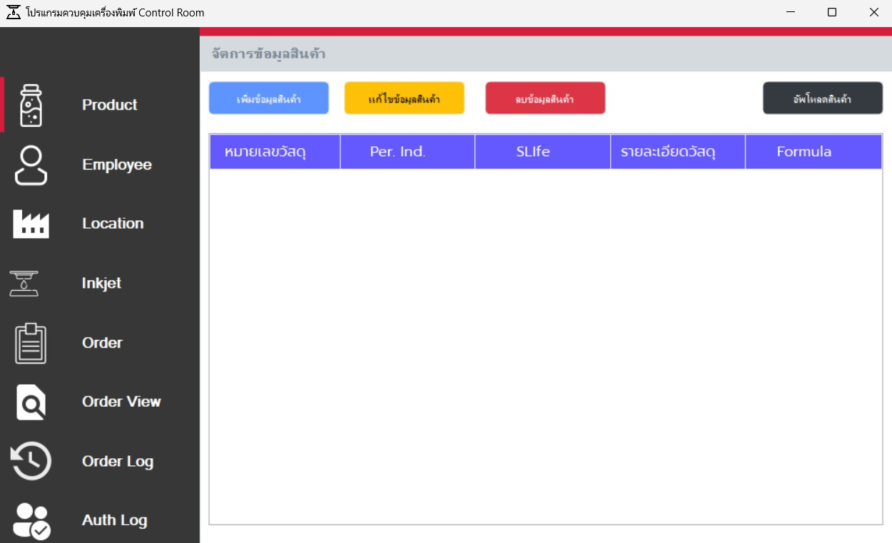
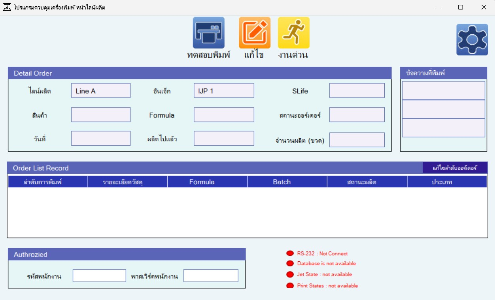

# 🚀 โปรแกรมควบคุมไลน์ผลิต (deksomboon)


## 📖 คำอธิบาย

โปรเจคต์นี้เป็นระบบสําหรับควบคุมเครื่องพิมพ์ Inkjet Linx รุ่น 8900 รองรับการเชื่อมต่อแบบ LAN 
โปรแกรมแยกการใช้งานออกเป็น 2 ส่วน คือ 1.Control Room 2.ควบคุมไลน์ผลิต

โปรแกรมส่วน Control Room ฟีเจอร์หลัก เช่น:  
- เพิ่ม, ลบ, แก้ไข รายการสินค้า และอัพโหลดรายการสินค้าผ่านไฟล์ csv
- เพิ่ม, ลบ, แก้ไข รายการพนักงาน
- เพิ่ม, ลบ, แก้ไข รายการไลน์ผลิต
- เพิ่ม, ลบ, แก้ไข รายการ Inkjet
- เพิ่ม, ลบ, แก้ไข รายการออร์เดอร์ และส่งไปที่ไลน์ผลิต
- ดูประวัติการส่งออร์เดอร์ สถานะ จํานวนผลิตแต่ละไลน์ผลิต
- ดูประวัติการ action วัน-เวลา Authorized
โปรแกรมส่วนควบคุมไลน์ผลิต ฟีเจอร์หลัก เช่น:
- ส่งข้อความไปที่เครื่องพิมพ์
- Start-Stop เครื่องพิมพ์ด้วยโปรแกรม
- เพิ่มรายการออร์เดอร์งานด่วน เพื่อผลิตก่อน
- สลับลําดับออร์เดอร์การผลิตได้อิสระ
- แก้ไขเลข batch และ BBF ได้อิสระ
- แสดงรายละเอียดออร์เดอร์ เช่น batch, bbf, จํานวนผลิต, วันที่, formual เป็นต้น
- ยืนยัน Process ต่างๆ ด้วยการ Authorized รหัสพนักงานและพาสเวิร์ด
- แสดงสถานะแบบ real-time เช่น RS-232, Database, JetState, Print States
- ระบบ OTP ทางอิเมล ยืนยันการแก้ไขและเริ่มผลิต

---

## 📸 ตัวอย่างหน้าจอ (Screenshots)

ภาพรวมการทำงานของระบบ:

  
*รูปที่ 1: หน้า controlroom*

  
*รูปที่ 2: หน้า ไลน์ผลิต*

---

## ⚙️ วิธีการติดตั้ง

1. Clone โปรเจกต์นี้ลงเครื่องของคุณ:
   ```bash 
   git clone https://github.com/ecctechs/inkjet-linx.git
   cd inkjet-linx


## 🖥️ วิธีใช้งาน
### ส่วนที่ 1: โปรแกรม Control Room
1. ผู้ใช้งานเข้าสู่โปรแกรม Control Room  
2. สร้างรายการสินค้า ในหน้า **Product**  
3. สร้างรายการพนักงาน ในหน้า **Employee**  
4. สร้างรายการไลน์ผลิต ในหน้า **Location**  
5. สร้างรายการ Inkjet ในหน้า **Inkjet**  
6. สร้างรายการ Order หรืออัพโหลดไฟล์ในหน้า **Order** และกดปุ่ม **ส่งออร์เดอร์** เพื่อส่งไปยังไลน์ผลิต  
7. รายการ Order ที่ถูกส่งไป จะถูกเก็บเป็น Log ในหน้า **OrderView**  

---

### ส่วนที่ 2: โปรแกรม Production Line
8. เข้าสู่โปรแกรม Production Line  
9. ทำการ Setting ไลน์ผลิต โดยกดปุ่ม **ฟันเฟือง** เพื่อระบุ  
   - Port  
   - ชื่อไลน์ผลิต  
   - เครื่อง Inkjet  
10. หลังจากบันทึกการตั้งค่า ข้อมูลจะถูกดึงมาแสดงในโปรแกรมอัตโนมัติ  
11. กดปุ่ม **ทดสอบพิมพ์** เพื่อส่งข้อความ batch และ bbf ไปยังเครื่องพิมพ์โดยอัตโนมัติ  
12. เมื่อทดสอบการพิมพ์เรียบร้อย ให้กดปุ่ม **เริ่มผลิต**  
    - ระบบจะเริ่มนับ Count และแสดงผลในช่อง "ผลิตไปแล้ว"  
13. เมื่อต้องการผลิต Order ถัดไป  
    - กดปุ่ม **จบออร์เดอร์**  
    - ระบบจะลบ Order ที่เสร็จแล้ว  
    - ไปยัง Order ถัดไป และส่งข้อความไปที่ Inkjet อัตโนมัติ  

หมายเหตุ
- การเริ่มผลิตและแก้ไขออร์เดอร์ รวมถึงเพิ่มงานด่วน จําเป็นต้อง login รหัสพนักงานและพาสเวิร์ด เพื่อยืนยัน OTP ทางอีเมลจาก Manager เพื่อเริ่มงานทุกครั้ง


## 🖥️ เครื่องมือที่ใช้ในการพัฒนา

1. ระบบปฏิบัติการ Windows 10  
2. Microsoft Visual Studio 2022
  - Guna.UI2.WinForms 2.0.4.7  
  - Newtonsoft.Json 13.0.3  
3. .NET Framework 4.7.2  
